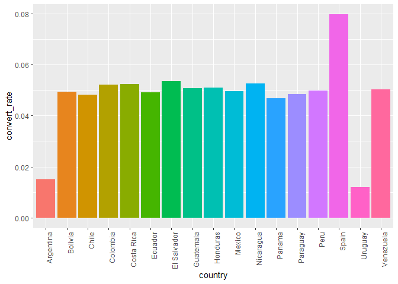
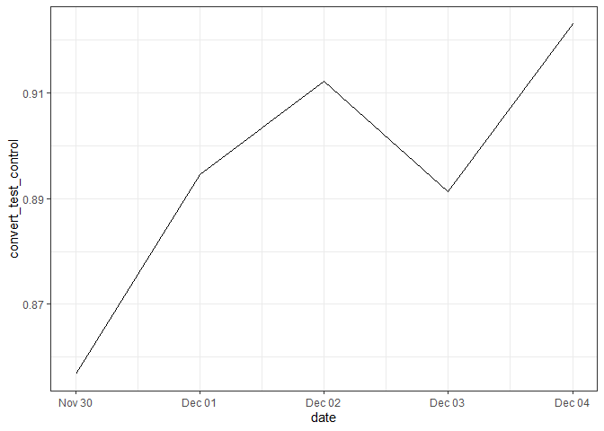

spanish\_translation
================

## Data Science Take Home Challenge 2

## Spanish Translation - A/B Testing

``` r
user <- read.csv("user_table.csv", stringsAsFactors = T)
test <- read.csv("test_table.csv", stringsAsFactors = T)
```

Have a look at the data:

``` r
head(user)
```

    ##   user_id sex age   country
    ## 1  765821   M  20    Mexico
    ## 2  343561   F  27 Nicaragua
    ## 3  118744   M  23  Colombia
    ## 4  987753   F  27 Venezuela
    ## 5  554597   F  20     Spain
    ## 6   62371   M  29   Ecuador

``` r
head(test)
```

    ##   user_id       date source device browser_language ads_channel     browser
    ## 1  315281 2015-12-03 Direct    Web               ES        <NA>          IE
    ## 2  497851 2015-12-04    Ads    Web               ES      Google          IE
    ## 3  848402 2015-12-04    Ads    Web               ES    Facebook      Chrome
    ## 4  290051 2015-12-03    Ads Mobile            Other    Facebook Android_App
    ## 5  548435 2015-11-30    Ads    Web               ES      Google     FireFox
    ## 6  540675 2015-12-03 Direct Mobile               ES        <NA> Android_App
    ##   conversion test
    ## 1          1    0
    ## 2          0    1
    ## 3          0    0
    ## 4          0    1
    ## 5          0    1
    ## 6          0    1

If we want to join the two tables, we must first make sure that the
user\_id matches one on one.

``` r
## Check if there are duplicates.
sum(sort(unique(user$user_id)) == sort(user$user_id))
```

    ## [1] 452867

``` r
sum(sort(unique(test$user_id)) == sort(test$user_id))
```

    ## [1] 453321

No duplicates in either dataset. How many mismatches are there between
two datasets?

``` r
sum(user$user_id %in% test$user_id)
```

    ## [1] 452867

``` r
sum(test$user_id %in% user$user_id)
```

    ## [1] 452867

So the user table lost some user information. It is not big problem as
the number of mismatches is small. We can simply drop the rows that are
not in user dataset.

``` r
df <- merge(user, test, by = "user_id")
df$date <- as.Date(df$date)
df$conversion <- as.logical(df$conversion)
summary(df)
```

    ##     user_id        sex             age             country      
    ##  Min.   :      1   F:188382   Min.   :18.00   Mexico   :128484  
    ##  1st Qu.: 249819   M:264485   1st Qu.:22.00   Colombia : 54060  
    ##  Median : 500019              Median :26.00   Spain    : 51782  
    ##  Mean   : 499945              Mean   :27.13   Argentina: 46733  
    ##  3rd Qu.: 749543              3rd Qu.:31.00   Peru     : 33666  
    ##  Max.   :1000000              Max.   :70.00   Venezuela: 32054  
    ##                                               (Other)  :106088  
    ##       date               source          device       browser_language
    ##  Min.   :2015-11-30   Ads   :181693   Mobile:201551   EN   : 63079    
    ##  1st Qu.:2015-12-01   Direct: 90738   Web   :251316   ES   :377160    
    ##  Median :2015-12-03   SEO   :180436                   Other: 12628    
    ##  Mean   :2015-12-02                                                   
    ##  3rd Qu.:2015-12-04                                                   
    ##  Max.   :2015-12-04                                                   
    ##                                                                       
    ##    ads_channel            browser       conversion           test       
    ##  Bing    : 13670   Android_App:154977   Mode :logical   Min.   :0.0000  
    ##  Facebook: 68358   Chrome     :101822   FALSE:430423    1st Qu.:0.0000  
    ##  Google  : 68113   FireFox    : 40721   TRUE :22444     Median :0.0000  
    ##  Other   :  4143   IE         : 61656                   Mean   :0.4765  
    ##  Yahoo   : 27409   Iphone_App : 46574                   3rd Qu.:1.0000  
    ##  NA's    :271174   Opera      :  6084                   Max.   :1.0000  
    ##                    Safari     : 41033

First see if Spain converts better than LatAm countries.

``` r
df_control <- df[df$test == 0, ]
df_test <- df[df$test == 1, ]
data_country <- df_control %>%
  group_by(country) %>%
  summarise(convert_rate = mean(conversion))%>%
  arrange(desc(convert_rate))
```

    ## `summarise()` ungrouping output (override with `.groups` argument)

``` r
ggplot(data_country, aes(x= country, y = convert_rate, fill = country)) +
  geom_col()+
  theme(axis.text.x=element_text(angle=90,hjust=1), legend.position = "none")
```

<!-- -->

It is correct that Spain converts more.

Let us see the distribution of control V.S. test:

``` r
mean(df$test) # so 47.64% of the rows are in the test set and the rest are in the control set
```

    ## [1] 0.4764622

Let us also see if the conversion rate of these two dataset is roughly
the same (with Spain ignored).

``` r
df_control_nospain <- subset(df_control, country != "Spain")
df <- subset(df, country != "Spain")
t.test(df_control_nospain$conversion, df_test$conversion)
```

    ## 
    ##  Welch Two Sample t-test
    ## 
    ## data:  df_control_nospain$conversion and df_test$conversion
    ## t = 7.3539, df = 385258, p-value = 1.929e-13
    ## alternative hypothesis: true difference in means is not equal to 0
    ## 95 percent confidence interval:
    ##  0.003579837 0.006181421
    ## sample estimates:
    ##  mean of x  mean of y 
    ## 0.04829179 0.04341116

Like what the country managers said, the conversion rate dropped
significantly with the test group. If the number is correct, we should
probably keep with the original Spanish translation.

Are there other reasons that may explain the drop in conversion rate?

## Plot the conversion rate by day.

``` r
df_by_day <- df %>%
  group_by(date) %>%
  summarise(convert_test_control = mean(conversion[test == 1])/mean(conversion[test == 0]))
```

    ## `summarise()` ungrouping output (override with `.groups` argument)

``` r
ggplot(df_by_day, aes(x = date, y= convert_test_control, label = round(convert_test_control, 2) ))+
  geom_line()+
  theme_bw()
```

<!-- -->
First notice that there are only five days in the time range, which may
involve weekend effect that may cause the bias.

The conversion rate in the test group is always lower than the control
group.

## Check A/B Test Randomization

First check data source:

``` r
data_by_source <- df %>%
  group_by(source) %>%
  summarise(test_freq = length(source[test == 1])/nrow(df[df$test == 1,]), 
            control_freq = length(source[test == 0])/nrow(df[df$test == 0,]))
```

    ## `summarise()` ungrouping output (override with `.groups` argument)

``` r
data_by_source
```

    ## # A tibble: 3 x 3
    ##   source test_freq control_freq
    ##   <fct>      <dbl>        <dbl>
    ## 1 Ads        0.401        0.401
    ## 2 Direct     0.200        0.201
    ## 3 SEO        0.400        0.398

I would say the distribution of data sources is roughly the same between
control and test.

## Build a model to find the factor that differentiates control and test group.

The idea is to use the existing variables (excluding conversion rate) to
predict if the data is in test or control. If the data is randomized
well, we should not be able to separate the two groups. If somehow we
manage separate the two groups, we are then able to find which variable
is playing a decisive role by checking the variable importance score.

Let us use decision tree.

``` r
require(rpart)
```

    ## Loading required package: rpart

``` r
require(rpart.plot)
```

    ## Loading required package: rpart.plot

``` r
df$test <- as.factor(df$test)
df_model <- subset(df,  select = -conversion)
# decision tree model
model_tree <- rpart(test ~., df_model, parms = list(prior = c(0.5, 0.5)))
model_tree
```

    ## n= 401085 
    ## 
    ## node), split, n, loss, yval, (yprob)
    ##       * denotes terminal node
    ## 
    ## 1) root 401085 200542.50 1 (0.5000000 0.5000000)  
    ##   2) country=Bolivia,Chile,Colombia,Costa Rica,Ecuador,El Salvador,Guatemala,Honduras,Mexico,Nicaragua,Panama,Paraguay,Peru,Venezuela 350218 162347.50 0 (0.5391991 0.4608009) *
    ##   3) country=Argentina,Uruguay 50867  10574.12 1 (0.2168199 0.7831801) *

So there is a big difference between the proportion of Argentinian and
Uruguayan users in control vs test.

``` r
df$argentina[df$country == "Argentina"] <- 1
df$argentina[df$country != "Argentina"] <- 0
df$uruguay[df$country == "Uruguay"] <- 1
df$uruguay[df$country != "Uruguay"] <- 0

df %>%
  group_by(test) %>%
  summarise(argen_rate = mean(argentina),
            urug_rate = mean(uruguay))
```

    ## `summarise()` ungrouping output (override with `.groups` argument)

    ## # A tibble: 2 x 3
    ##   test  argen_rate urug_rate
    ##   <fct>      <dbl>     <dbl>
    ## 1 0         0.0505   0.00224
    ## 2 1         0.173    0.0172

There are a lot more Argentina and Uruguay users in the test set than in
the control set. The difference in conversion rate between test group
and control group may due to the difference in behaviors between the two
countries and the rest countries.

## Remove suspicous countries

By removing the data from the two countries, we can test again if there
is a difference in conversion rate between test and control.

``` r
t.test(df$conversion[df$test == 0], df$conversion[df$test == 1])
```

    ## 
    ##  Welch Two Sample t-test
    ## 
    ## data:  df$conversion[df$test == 0] and df$conversion[df$test == 1]
    ## t = 7.3539, df = 385258, p-value = 1.929e-13
    ## alternative hypothesis: true difference in means is not equal to 0
    ## 95 percent confidence interval:
    ##  0.003579837 0.006181421
    ## sample estimates:
    ##  mean of x  mean of y 
    ## 0.04829179 0.04341116

``` r
t.test(df$conversion[df$test == 0 & !df$country %in% c("Argentina", "Uruguay")], 
       df$conversion[df$test == 1 & !df$country %in% c("Argentina", "Uruguay")])
```

    ## 
    ##  Welch Two Sample t-test
    ## 
    ## data:  df$conversion[df$test == 0 & !df$country %in% c("Argentina", "Uruguay")] and df$conversion[df$test == 1 & !df$country %in% c("Argentina", "Uruguay")]
    ## t = -0.35835, df = 350197, p-value = 0.7201
    ## alternative hypothesis: true difference in means is not equal to 0
    ## 95 percent confidence interval:
    ##  -0.001712121  0.001182831
    ## sample estimates:
    ##  mean of x  mean of y 
    ## 0.05014811 0.05041276

After removing the two countries, there is no difference in conversion
rate between the test group and the control group.

``` r
df_test_country = df %>%
                    group_by(country) %>%
                    summarize( p_value = t.test(conversion[test==1], conversion[test==0])$p.value,
                               conversion_test = t.test( conversion[test==1], conversion[test==0])$estimate[1],
                               conversion_control = t.test( conversion[test==1],conversion[test==0])$estimate[2]) 
```

    ## `summarise()` ungrouping output (override with `.groups` argument)

``` r
df_test_country
```

    ## # A tibble: 16 x 4
    ##    country     p_value conversion_test conversion_control
    ##    <fct>         <dbl>           <dbl>              <dbl>
    ##  1 Argentina     0.335          0.0137             0.0151
    ##  2 Bolivia       0.719          0.0479             0.0494
    ##  3 Chile         0.303          0.0513             0.0481
    ##  4 Colombia      0.424          0.0506             0.0521
    ##  5 Costa Rica    0.688          0.0547             0.0523
    ##  6 Ecuador       0.962          0.0490             0.0492
    ##  7 El Salvador   0.248          0.0479             0.0536
    ##  8 Guatemala     0.572          0.0486             0.0506
    ##  9 Honduras      0.471          0.0475             0.0509
    ## 10 Mexico        0.166          0.0512             0.0495
    ## 11 Nicaragua     0.780          0.0542             0.0526
    ## 12 Panama        0.705          0.0494             0.0468
    ## 13 Paraguay      0.884          0.0492             0.0485
    ## 14 Peru          0.772          0.0506             0.0499
    ## 15 Uruguay       0.880          0.0129             0.0120
    ## 16 Venezuela     0.574          0.0490             0.0503

## Conclusion

The lower conversion rate in the test group compared to the control
group is due to the imbalanced population of users from Argentina and
Uruguay. After we remove the data from the two countries, the conversion
rate is comparable between control and test group.
